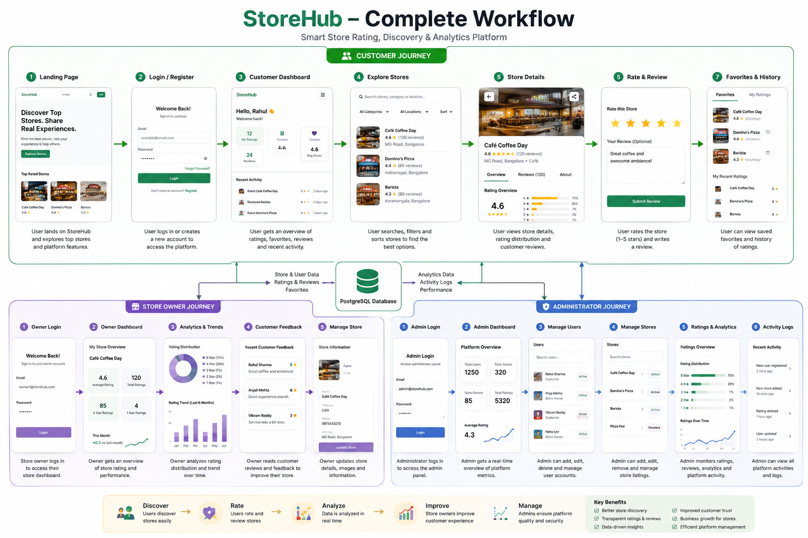

StoreHub

Smart Store Discovery, Ratings & Analytics Platform

StoreHub is a full-stack platform that connects customers with trusted local businesses through transparent ratings, reviews, store discovery, and actionable analytics.

The platform provides a unified ecosystem for three user roles:

Customers — discover stores, rate experiences, write reviews, and save favorites.

Store Owners — monitor customer feedback, understand rating trends, and manage their store presence.

Administrators — manage users, stores, ratings, platform activity, and business analytics.

Overview

StoreHub is designed to make local business discovery more transparent and data-driven.

Customers can discover businesses, explore ratings and reviews, and share their experiences.

Store owners can understand how customers perceive their business through real-time rating analytics and feedback.

Administrators can manage the complete platform through a centralized management dashboard.

Core Flow

Customer
   │
   ├── Discover Store
   │
   ├── View Ratings & Reviews
   │
   ├── Rate Store
   │
   ├── Write Review
   │
   └── Save Favorite
          │
          ▼
      StoreHub
          │
          ├── Rating Analytics
          ├── Store Performance
          ├── Customer Feedback
          └── Platform Analytics
                    │
                    ▼
              Store Owner / Admin
## 🔄 Complete Platform Workflow

The following workflow illustrates the complete StoreHub ecosystem, including the Customer, Store Owner, and Administrator journeys, from store discovery and ratings to analytics, management, and platform operations.

<p align="center">
  
</p>

### Platform Flow

```text
Customer Journey
Landing Page
    ↓
Login / Register
    ↓
Customer Dashboard
    ↓
Explore Stores
    ↓
Store Details
    ↓
Rate & Review
    ↓
Favorites & Rating History

                    ↓
                 StoreHub
                    ↓
             PostgreSQL Database
                    ↓

Store Owner Journey              Administrator Journey
Owner Login                      Admin Login
    ↓                                ↓
Owner Dashboard                  Admin Dashboard
    ↓                                ↓
Analytics & Trends               User Management
    ↓                                ↓
Customer Feedback                Store Management
    ↓                                ↓
Manage Store                     Ratings & Analytics
                                  ↓
                               Activity Logs

Product HighlightsCustomer Experience

Customers get a modern store discovery experience with:

Store searchCategory-based discoveryLocation-based filteringRating-based filteringSorting and paginationStore detailsRating distributionCustomer reviewsInteractive 1–5 star ratingReview submissionRating updatesFavorite storesRating historyPersonalized dashboardRating Experience

Customers can:

Select Rating↓Write Review↓Submit Feedback↓Store Rating Updated↓Analytics Updated↓Store Owner Notified Through Dashboard

Each customer can maintain a single rating per store, with the ability to update their existing rating.

Store Owner Experience

Store owners receive a dedicated analytics workspace for understanding customer feedback.

Dashboard MetricsAverage ratingTotal ratingsFive-star ratingsOne-star ratingsMonthly ratingsRating trendsRating distributionCustomer feedbackPerformance Analytics

Store owners can visualize:

Rating distributionHistorical rating trendsMonthly performanceCustomer feedbackStore profile information

This allows businesses to identify strengths and areas that may require improvement.

Administrator Experience

Administrators have complete control over the platform.

User Management

Administrators can:

Create usersEdit usersDelete usersActivate/deactivate accountsSearch usersFilter by roleFilter by account statusAssign rolesView user information

Supported roles:

ADMINSTORE_OWNERUSERStore Management

Administrators can:

Create storesEdit storesDelete storesActivate/deactivate storesAssign store ownersManage store categoriesManage store contact informationManage store descriptionsManage store imagesRating Management

Administrators can:

View customer ratingsReview submitted commentsModerate inappropriate reviewsDelete ratingsMonitor rating trendsView platform-wide rating statistics

Store averages are automatically recalculated whenever ratings are created, updated, or removed.

Platform Analytics

The administrator dashboard provides interactive analytics including:

Total usersTotal storesTotal ratingsStore ownersPlatform average ratingRating distributionRating trendsUser growthStore growthRole distributionTop-rated storesMost-reviewed stores

Supported analytics ranges:

7 Days30 Days90 Days1 YearAll TimeSecurity

StoreHub is designed with a security-focused backend architecture.

AuthenticationJWT-based authenticationBearer token authorizationbcrypt password hashingRole-based access controlProtected API routesSession validationAPI SecurityHelmet security headersCORS protectionExpress rate limitingZod request validationCentralized error handlingInput sanitizationProtected administrative endpointsAuthorization

Every protected request is validated against the authenticated user's role.

ADMIN├── User Management├── Store Management├── Rating Moderation├── Analytics└── Activity Logs

STORE_OWNER├── Store Analytics├── Customer Feedback└── Store Profile

USER├── Store Discovery├── Ratings├── Reviews├── Favorites└── Rating HistoryTechnology StackFrontendTechnology	PurposeReact	User interfaceTypeScript	Type safetyVite	Frontend toolingTailwind CSS	UI stylingFramer Motion	AnimationsRecharts	Analytics & chartsLucide React	Interface iconsAxios	API communicationSonner	NotificationsBackendTechnology	PurposeNode.js	RuntimeExpress.js	REST APITypeScript	Type safetyPrisma	ORMJWT	Authenticationbcryptjs	Password hashingZod	Request validationHelmet	HTTP securityCORS	Cross-origin protectionExpress Rate Limit	API protectionJest	TestingSupertest	API testingDatabase

PostgreSQL

Core entities:

UserStoreRatingFavoriteActivityLogSystem Architecture┌─────────────────────────────────────┐│             StoreHub UI             ││          React + TypeScript         ││         Vite + Tailwind CSS         │└──────────────────┬──────────────────┘││ REST API / HTTPS▼┌─────────────────────────────────────┐│          StoreHub Backend            ││       Node.js + Express + TS        │├─────────────────────────────────────┤│ Authentication & Authorization      ││ User Management                     ││ Store Management                    ││ Rating Management                   ││ Favorites                           ││ Analytics                           ││ Activity Logs                       │└──────────────────┬──────────────────┘││ Prisma ORM▼┌─────────────────────────────────────┐│           PostgreSQL                │├─────────────────────────────────────┤│ Users                               ││ Stores                              ││ Ratings                             ││ Favorites                           ││ Activity Logs                       │└─────────────────────────────────────┘Database DesignUser

Stores authentication and account information.

User├── id├── name├── email├── password├── role├── address├── status└── createdAtStore

Stores business information.

Store├── id├── name├── category├── address├── description├── phone├── website├── image├── ownerId└── statusRating

Stores customer feedback.

Rating├── id├── userId├── storeId├── rating├── review├── createdAt└── updatedAt

A unique constraint prevents duplicate ratings:

(userId + storeId)Favorite

Stores customer bookmarks.

Favorite├── id├── userId├── storeId└── createdAtActivityLog

Tracks important platform actions.

ActivityLog├── id├── userId├── action├── metadata└── createdAtProject Structurestorehub/│├── client/│   ├── public/│   ││   └── src/│       ├── components/│       │   └── common/│       ││       ├── context/│       │   ├── AuthContext│       │   └── ThemeContext│       ││       ├── pages/│       │   ├── LandingPage│       │   ├── LoginPage│       │   └── RegisterPage│       ││       ├── pages/admin/│       ├── pages/user/│       ├── pages/owner/│       ││       ├── services/│       ││       ├── types/│       ││       ├── App.tsx│       └── main.tsx│├── server/│   ├── prisma/│   │   ├── schema.prisma│   │   ├── migrations/│   │   └── seed.ts│   ││   └── src/│       ├── config/│       ├── controllers/│       ├── middleware/│       ├── routes/│       ├── validators/│       ├── app.ts│       └── server.ts│├── .gitignore├── .env.example├── package.json└── README.md

📚 Documentation Assets

The repository includes one complete workflow diagram used in this README:

docs/
└── storehub-workflow.png

Getting StartedPrerequisites

Install:

Node.js 18+npmPostgreSQLGit

Verify:

node --versionnpm --versionpsql --versionInstallation

Clone the repository:

git clone https://github.com/ShreyashMehta179/STORE-RATING-PLATFORM.git

Navigate into the project:

cd STORE-RATING-PLATFORM

Install dependencies:

npm install

Install client dependencies:

cd clientnpm installcd ..

Install server dependencies:

cd servernpm installcd ..Environment Configuration

Create:

server/.env

Example:

PORT=5000NODE_ENV=development

DATABASE_URL="postgresql://postgres@localhost:5432/storehub_db?schema=public"

JWT_SECRET="YOUR_SECRET_KEY"JWT_EXPIRES_IN="7d"

CLIENT_URL="http://localhost:5173"

Never commit .env to Git.

Use .env.example for sharing configuration structure.

Database Setup

Create the PostgreSQL database:

CREATE DATABASE storehub_db;

Run Prisma migrations:

npx prisma migrate dev

Generate Prisma Client:

npx prisma generate

Seed development data:

npm run dbRunning the Application

Start the development environment:

npm run dev

Frontend:

http://localhost:5173

Backend:

http://localhost:5000

Health check:

http://localhost:5000/healthTesting

Run backend tests:

npm run test

Build the frontend:

cd clientnpm run build

Build the backend:

cd servernpm run buildProduction Deployment

StoreHub can be deployed using:

Frontend↓Vercel

Backend↓Render

Database↓PostgreSQLProduction ArchitectureCustomer│▼VercelReact + Vite││ HTTPS▼RenderExpress + Node.js││ Prisma▼PostgreSQL

For production database migrations:

npx prisma migrate deploy

Production environment variables should be configured directly through the hosting provider.

API Modules

The backend is organized into REST API modules.

/api/auth/api/users/api/stores/api/ratings/api/favorites/api/analytics/api/activityAuthenticationPOST /api/auth/registerPOST /api/auth/loginPOST /api/auth/logoutGET  /api/auth/meStoresGET    /api/storesGET    /api/stores/POST   /api/storesPUT    /api/stores/DELETE /api/stores/RatingsGET    /api/ratingsPOST   /api/ratingsPUT    /api/ratings/DELETE /api/ratings/FavoritesGET    /api/favoritesPOST   /api/favoritesDELETE /api/favorites/

Actual routes may vary based on the current implementation.

User RolesAdministrator

Responsible for:

Platform managementUser managementStore managementRating moderationAnalyticsActivity monitoringData exportsStore Owner

Responsible for:

Store profileCustomer feedbackRating analyticsPerformance monitoringCustomer

Responsible for:

Store discoveryRatingsReviewsFavoritesPersonal rating historyDesign System

StoreHub follows a clean, modern visual system designed around trust and local commerce.

Primary Visual LanguageStoreHub GreenWhiteSoft neutral backgroundsGold rating starsSubtle shadowsRounded cardsSmooth transitionsResponsive layoutsInteraction Design

The interface uses:

Framer Motion animationsHover statesAnimated rating starsInteractive chartsToast notificationsModal interactionsSmooth page transitionsResponsive navigation

Animations are intentionally subtle to maintain a professional SaaS experience.

Data & Analytics

StoreHub calculates platform metrics from actual PostgreSQL data.

Examples:

Average Store RatingTotal RatingsRating DistributionMonthly Rating GrowthUser GrowthStore GrowthMost Reviewed StoresTop Rated Stores

Analytics are not hardcoded and are generated from database records.

Security Considerations

The following must never be committed:

.envDATABASE_URLJWT_SECRETDatabase passwordsAPI keysProduction credentials

For production:

Use HTTPSUse a strong JWT secretConfigure CORS to the production frontendUse secure database credentialsEnable database backupsUse environment variables for secretsKeep dependencies updatedRoadmap

Future StoreHub improvements may include:

Google authenticationEmail verificationPassword reset through emailStore owner registration approvalLocation-based discoveryMaps integrationAdvanced recommendation engineAI-powered review summarizationSentiment analysisBusiness insightsNotificationsReview helpfulness votingImage uploads for reviewsStore claim verificationAdvanced admin reportingPWA/mobile experienceProject Status

Status: Active Development

StoreHub currently provides a complete foundation for:

Authentication+Role-Based Access Control+Store Discovery+Ratings & Reviews+Favorites+Store Owner Analytics+Admin Management+Platform AnalyticsLicense

This project is licensed under the MIT License.

Author

Shreyash Mehta

Computer Science & Engineering

Full-Stack Developer | AI/ML | Software Development

StoreHub

Discover better. Share experiences. Build trust.
